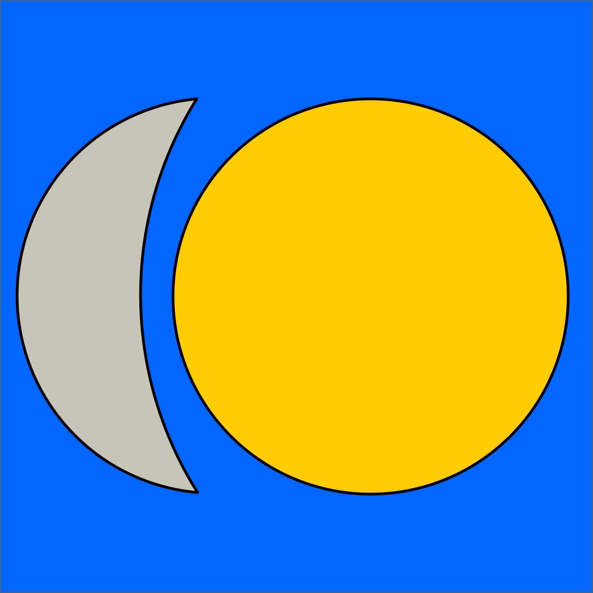

# gliched - An IDE for the Glich Script Language

This is just the beginnings of an IDE.
It allows scripts to be written and run.
It also shows the current state of Glich variables and objects.

The documentation for the project is being created on a
[website](https://nickmat.github.io/gliched/index.htm)
as part of this repository.
